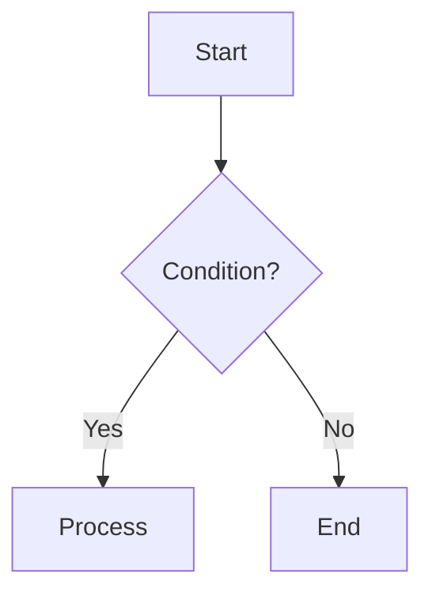
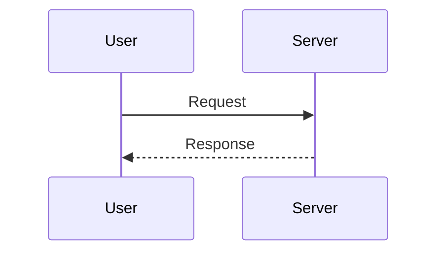

# Visual Communicator Skill

## Purpose
To ensure that complex ideas are always accompanied by visual representations using Mermaid diagrams, adhering to the standard defined in `GEMINI.md`.

## Trigger Conditions
- User asks for an explanation of code, architecture, or flow.
- You are writing a `spec` or `implementation_plan`.
- User explicitly asks for a diagram.

## Decision Logic: Which Diagram?

| Scenario | Diagram Type | Syntax |
| :--- | :--- | :--- |
| **Logic/Process/Decision Tree** | Flowchart | `graph TD` |
| **API Calls/Protocol/Interactions** | Sequence | `sequenceDiagram` |
| **Data Models/Classes/DB Schema** | Class | `classDiagram` |
| **State Changes/Lifecycle** | State | `stateDiagram-v2` |
| **Timeline/Roadmap** | Gantt | `gantt` |

## Execution Rules
1.  **Always Visualize**: Do not just explain with text; show it with a diagram first.
2.  **Syntax Safety**:
    -   Quote labels with special chars: `id["Label (Info)"]`.
    -   Avoid HTML in labels if possible.
3.  **Context Placement**:
    -   If writing an Artifact (markdown), embed the diagram directly.
    -   If chatting, provide the diagram in the chat response.

## Example Templates

### Flowchart

### Sequence

